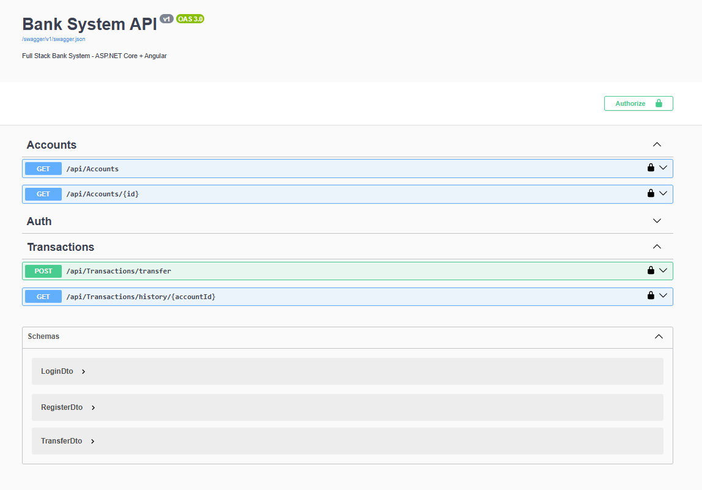
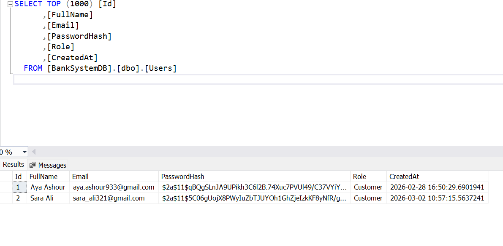
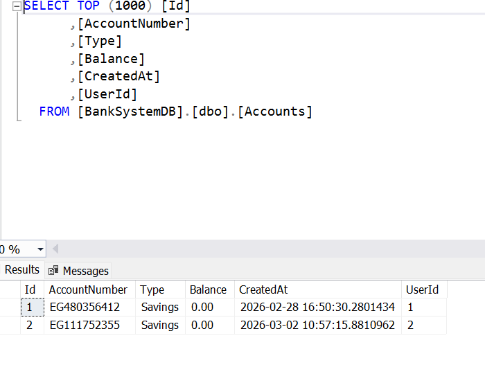
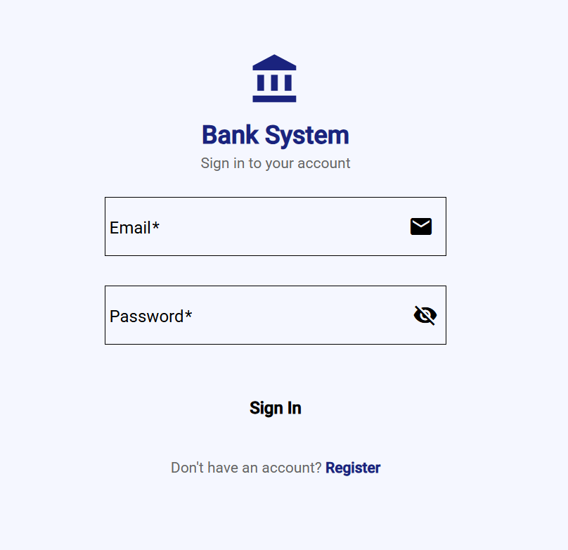
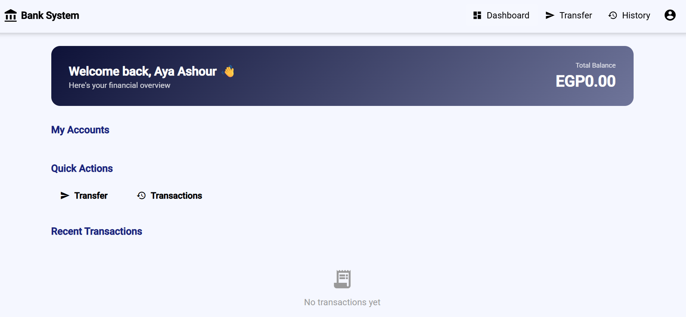
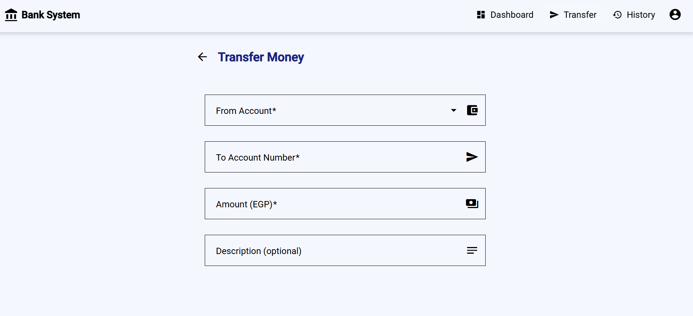
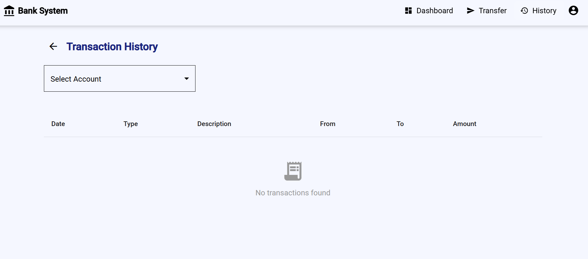

# 🏦 Bank System — Full Stack Web Application

A modern, full-stack banking system built with **ASP.NET Core 8 Web API** and **Angular 20**, featuring JWT authentication, account management, fund transfers, and transaction history.

## ✨ Features

- **User Registration & Login** with JWT Authentication
- **Auto-generated Account Number** on registration
- **Dashboard** showing account balance and recent transactions
- **Fund Transfers** between accounts with validation
- **Transaction History** with direction indicators (incoming/outgoing)
- **Auth Guard** protecting all dashboard routes
- **HTTP Interceptor** auto-attaching Bearer token to every request
- **Responsive UI** built with Angular Material

---

## 🛠️ Tech Stack

### Backend
| Technology | Purpose |
|---|---|
| ASP.NET Core 8 | Web API Framework |
| Entity Framework Core | ORM & Database Management |
| SQL Server | Relational Database |
| JWT Bearer | Authentication & Authorization |
| BCrypt.Net | Password Hashing |
| Swagger / OpenAPI | API Documentation |

### Frontend
| Technology | Purpose |
|---|---|
| Angular 20 | Frontend Framework |
| Angular Material 20 | UI Component Library |
| RxJS | Reactive Programming |
| TypeScript 5.9 | Type-safe JavaScript |


---

## 🗄️ Database Schema

```sql
Users         → Id, FullName, Email, PasswordHash, Role, CreatedAt
Accounts      → Id, UserId, AccountNumber, Type, Balance, CreatedAt
Transactions  → Id, FromAccountId, ToAccountId, Amount, Type, Description, Date
```

### ⚙️ Backend Setup (BankAPI)

**1. Clone the repository**
```bash
git clone https://github.com/ayaashour2002/BankAP.git
```

**2. Update `appsettings.json`**
```json
{
  "ConnectionStrings": {
    "DefaultConnection": "Server=YOUR_SERVER;Database=BankSystemDB;Integrated Security=True;TrustServerCertificate=True;"
  },
  "Jwt": {
    "Key": "YourSuperSecretKeyMustBe32CharsMinimum!!",
    "Issuer": "BankAPI",
    "Audience": "BankClient"
  }
}
```

**3. Run Migrations**
```bash
dotnet ef migrations add InitialCreate
dotnet ef database update
```

**4. Run the API**
```bash
dotnet run
```

API will be available at: `http://localhost:5142`
Swagger UI at: `http://localhost:5142/swagger`

---

## 📡 API Endpoints

### 🔐 Auth
| Method | Endpoint | Description | Auth Required |
|---|---|---|---|
| POST | `/api/auth/register` | Register new user | ✅ |
| POST | `/api/auth/login` | Login & get JWT token | ✅ |

### 🏦 Accounts
| Method | Endpoint | Description | Auth Required |
|---|---|---|---|
| GET | `/api/accounts` | Get current user's accounts | ✅ |
| GET | `/api/accounts/{id}` | Get account by ID | ✅ |

### 💸 Transactions
| Method | Endpoint | Description | Auth Required |
|---|---|---|---|
| POST | `/api/transactions/transfer` | Transfer money | ✅ |
| GET | `/api/transactions/history/{accountId}` | Get transaction history | ✅ |

---

### 📝 Request Examples

**Register**
```json
POST /api/auth/register
{
  "fullName": "Aya Ashour",
  "email": "aya.ashour933@gmail.com",
  "password": "Aya@1234"
}
```

**Transfer**
```json
POST /api/transactions/transfer
Authorization: Bearer {token}
{
  "fromAccountId": 1,
  "toAccountNumber": "EG123456789",
  "amount": 5000,
  "description": "Rent payment"
}
```

---

## 🔒 Security

- Passwords are hashed using **BCrypt** before storage
- All protected endpoints require a valid **JWT Bearer token**
- Tokens expire after **7 days**
- **Auth Guard** prevents unauthorized access to frontend routes
- **HTTP Interceptor** automatically attaches the token to every API request

---


## 📸 Screenshots

### 🔐 Swagger


### 🔐 SQL

### 🔐 SQL


### 🔐 Login Page


### 📊 Dashboard


### 💸 Transfer Money


### 📋 Transaction History


> 💡 Add your screenshots to a `/screenshots` folder in the root of the repository.

---

